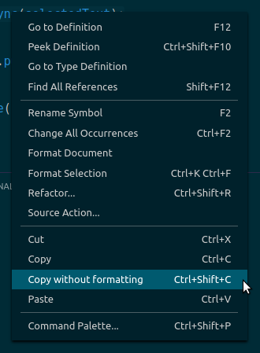

Visual Studio Code extension to copy text without formatting

## Features

- Adds the ability to copy text without formatting (syntax highlighting, font, etc)
- Accessible from the right-click context menu or these keyboard shortcuts:
  - Linux/Windows: <kbd>Ctrl</kbd>+<kbd>Shift</kbd>+<kbd>C</kbd>
  - Mac: <kbd>Shift</kbd>+<kbd>⌘</kbd>+<kbd>C</kbd>



## Development

1. Clone this project

1. Install dependencies

   ```
   npm i
   ```

1. Open this project in its own window in Visual Studio Code

   ```
   code .
   ```

1. Run the extension

   Press <kbd>F5</kbd> in Visual Studio Code
